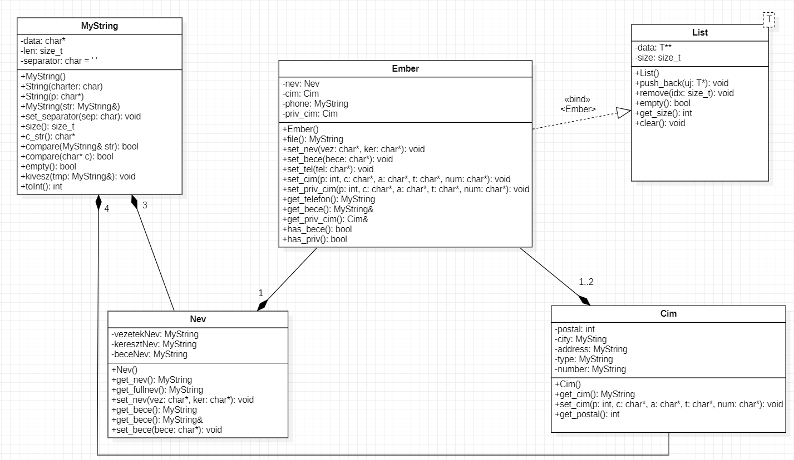
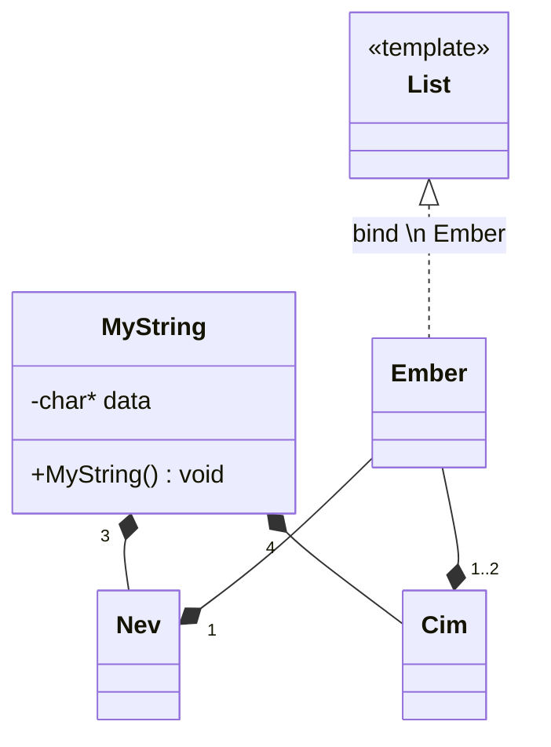

# Telefonkönyv

A *programozás alapjai 2* tárgy nagy házi feladata  
40 / 40 pont

## Tartalomjegyzék

1. [A program célja](#1-A-program-célja)
2. [A program működsének feltételei](#2-A-program-működésének-feltételei)
3. [A program futtatása](#3-A-program-futtatása)
    * [Kilépés](#3.1-Kilépés)
    * [Elérhető parancsok listázása](#3.2-Elérhető-parancsok-listázása)
    * [Adatok mentése](#3.3-Adatok-mentése)
    * [Felvétel](#3.4-Felvétel)
    * [Törlés](#3.5-Törlés)
    * [Összes adat listázása](#3.6-Összes-adat-listázása)
4. [Futási hibák](#4-Futási-hibák)
5. [UML](#5-uml)
6. [Kiegészítés](#6-kiegészítés)
    * [UML osztályok kódból](#61-uml-osztyok-kdbl)

---

## 1 A program célja

A feladat egy olyan program készítése, melyben emberek adatait lehet felvenni, valamint törölni és listázni azokat.

## 2 A program működésének feltételei

A program működésének nincs semmi előfeltétele.  
A program egy *adatok.dat* fájlt használ az emberek adatainak tárolására, azonban azt a futás elején ellenőrzi és amennyiben az nem létezik létrehozza azt.

## 3 A program futtatása

A programot a `telefonkonyv` parancs kiadásával lehet. Ezt követően a következő lehetőségeink vannak:

### 3.1 Kilépés

A program leállítása és az adatok mentése az `exit` paranccsal érhető el.

### 3.2 Elérhető parancsok listázása

A elérhető parancsok listája előhívható a `help` parancs kiadásával.

### 3.3 Adatok mentése

Az adatok futásidejű mentésére a `save` parancs kiadásával van lehetőség.

### 3.4 Felvétel

Amennyiben új adatot kívánunk felvenni:
`add <Név> <Cím> <Telefonszám> [Becenev] [Privát cím]`

### 3.5 Törlés

Meglévő adat törlésére az alávvi paranccsal van lehetőségünk:
`remove <Telefonszám>`  

Mivel a telefonszám az egyetlen egyedi információ, így kizáólag annak megadásával van lehetőség egy adat törlésére.  

### 3.6 Összes adat listázása

A telefonkönyvben szereplő összes adat kiírása a `show` parancs kiadását követően jelenik meg.

Sikeres lefutás esetén kilistázza a jelenleg a telefonkönyvben lévő adatokat a következő formátumban:  
>Vezetéknév Keresztnév (Becenév) Telefonszám Cím PrivátCím

A becenevet, valamint a privát címet kizárólag akkor írja ki, ha meg vot adva.

## 4 Futási hibák

A program futása során a keletkező hibák hatására leáll és a szabványos kimenetre kiírja az adott hibát, melyek a következők lehetnek:
- 1: Túlindexelés
- 2: Hiba a fájl megnyitása közben
- 4: Nem megfelelő az adatok mennyisége
- 5: Nem létező telefonszám
- 6: Már létező telefonszám

## 5 UML

## 6 Kiegészítés

### 6.1 UML osztáyok kódból

